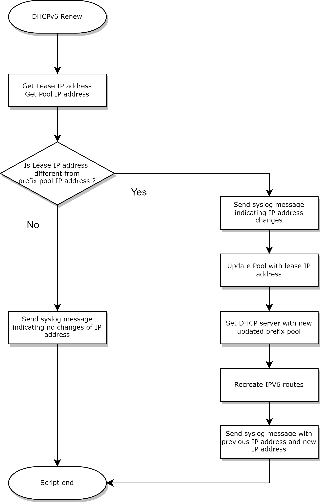

## Cisco dynamic DHCPv6 prefix delegation script

## Use case

Cisco 15.8-3 firmware doesn't support dynamic IPv6 prefix pool assignation from a DHCPv6. This script aims to mitigate this issue.
This script is useful when having an ISP that only provides dynamic IPv6 prefix.

Tested on C897 with 15.8-3 firmware


## Script

This script isn't plug&play. The trigger, the regexp and ipv6 routes will have to be adapted.

The script will be trigged when renewing the lease DHCP lease then it will compare the new IP address with the IP address previously received. 
If the new ip is different from the old one it will update the DHCPv6-PD pool and update the route.



```
event manager applet DHCPV6-monitor
 event syslog pattern "IPv6 DHCP: T1 set to expire in 3600 seconds" maxrun 150
 
 action 10 syslog priority alerts msg "IPV6 Prefix check in progress"
 action 11 cli command "enable"

 action 12 cli command "show ipv6 general-prefix | i 2A02"
 action 13 regexp "2A02\:....\:....\:....\:\:\/.." "$_cli_result" match1
 
 action 14 cli command "show ipv6 local pool V6P | i 2A02"
 action 15 regexp "2A02\:....\:....\:....\:\:\/.." "$_cli_result" match2
 
 action 16 if $match1 eq $match2
 action 17  syslog priority alerts msg "no IPV6 prefix change keeping $match1"
 action 18 else
 action 19  syslog priority alerts msg "new IPV6 prefix detected"
 action 20  cli command "config t"
 action 21  cli command "no ipv6 dhcp pool DHCP6"
 action 22  cli command "no ipv6 local pool V6P"
 action 23  cli command "ipv6 local pool V6P $match1 60"
 action 24  cli command "ipv6 dhcp pool DHCP6"
 action 25  cli command "prefix-delegation pool V6P lifetime 86400 86400"
 action 26  cli command "no ipv6 route $match2 Vlan1 FE80::1"
 action 27  cli command "ipv6 route $match1 Vlan1 FE80::1"
 action 28  cli command "do write memory"
 action 29  syslog priority alerts msg "IPV6 update done, new prefix is $match1"
 action 30  syslog priority alerts msg "previous IPV6 prefix was $match2"
 action 31 end
 
end 
```
